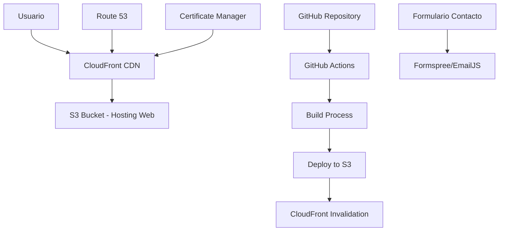

# Documento de Diseño

## Visión General

La landing web del taller mecánico será una aplicación web estática moderna construida con HTML, CSS y JavaScript vanilla, optimizada para rendimiento y SEO. Utilizará un diseño responsive con enfoque mobile-first y estará alojada en AWS S3 con CloudFront para distribución global. El despliegue será completamente automatizado usando GitHub Actions.

## Arquitectura

### Arquitectura de Alto Nivel



### Stack Tecnológico

- **Frontend:** HTML5, CSS3 (con Flexbox/Grid), JavaScript ES6+
- **Styling:** CSS personalizado con variables CSS y media queries
- **Build Tools:** Vite para desarrollo y build optimizado
- **Hosting:** AWS S3 Static Website Hosting
- **CDN:** AWS CloudFront
- **DNS:** AWS Route 53
- **SSL:** AWS Certificate Manager
- **CI/CD:** GitHub Actions
- **Formulario:** Formspree o EmailJS para manejo de contacto

## Componentes e Interfaces

### Estructura de Páginas

#### Página Principal (index.html)
- **Header/Navegación**
  - Logo del taller
  - Menú de navegación (Inicio, Servicios, Nosotros, Contacto)
  - Botón de llamada a la acción

- **Sección Hero**
  - Título principal atractivo
  - Subtítulo descriptivo
  - Botón CTA principal
  - Imagen de fondo del taller

- **Sección Servicios**
  - Grid de servicios con iconos
  - Descripción breve de cada servicio
  - Precios aproximados (opcional)

- **Sección Sobre Nosotros**
  - Historia del taller
  - Experiencia y certificaciones
  - Fotos del equipo/instalaciones

- **Sección Contacto**
  - Formulario de contacto
  - Información de contacto (teléfono, dirección, horarios)
  - Mapa de ubicación (Google Maps embed)

- **Footer**
  - Información de contacto resumida
  - Enlaces a redes sociales
  - Copyright

### Componentes Reutilizables

#### ServiceCard Component
```javascript
class ServiceCard {
  constructor(title, description, icon, price) {
    this.title = title;
    this.description = description;
    this.icon = icon;
    this.price = price;
  }
  
  render() {
    // Retorna HTML del componente
  }
}
```

#### ContactForm Component
```javascript
class ContactForm {
  constructor(formspreeEndpoint) {
    this.endpoint = formspreeEndpoint;
    this.setupValidation();
    this.setupSubmission();
  }
  
  validate() {
    // Validación de campos
  }
  
  submit() {
    // Envío a Formspree
  }
}
```

## Modelos de Datos

### Configuración del Sitio
```javascript
const siteConfig = {
  taller: {
    nombre: "Taller Mecánico [Nombre]",
    direccion: "Dirección completa, Comuna, Región",
    telefono: "+56 9 XXXX XXXX",
    email: "contacto@tallermecánico.cl",
    horarios: {
      lunes_viernes: "08:00 - 18:00",
      sabado: "08:00 - 13:00",
      domingo: "Cerrado"
    }
  },
  servicios: [
    {
      id: 1,
      titulo: "Mantención Preventiva",
      descripcion: "Revisión completa del vehículo",
      icono: "wrench",
      precio: "Desde $25.000"
    },
    // ... más servicios
  ]
};
```

### Formulario de Contacto
```javascript
const contactFormData = {
  nombre: String,
  email: String,
  telefono: String,
  servicio: String,
  mensaje: String,
  timestamp: Date
};
```

## Infraestructura AWS

### S3 Configuration
- **Bucket Name:** `taller-mecanico-landing-web`
- **Static Website Hosting:** Habilitado
- **Index Document:** `index.html`
- **Error Document:** `404.html`
- **Public Read Access:** Configurado via Bucket Policy

### CloudFront Distribution
- **Origin:** S3 Bucket Website Endpoint
- **Caching:** Optimizado para contenido estático
- **Compression:** Habilitado
- **Security Headers:** Configurados
- **Custom Error Pages:** 404 redirect a index.html para SPA behavior

### Route 53 & Certificate Manager
- **Domain:** Dominio personalizado del cliente
- **SSL Certificate:** Wildcard certificate via ACM
- **DNS Records:** A record apuntando a CloudFront

## Manejo de Errores

### Frontend Error Handling
- Validación de formularios en tiempo real
- Mensajes de error amigables al usuario
- Fallbacks para contenido que no carga
- Página 404 personalizada

### Deployment Error Handling
- Rollback automático en caso de fallo
- Notificaciones de estado del deployment
- Health checks post-deployment
- Logs detallados en GitHub Actions

## Estrategia de Testing

### Testing Manual
- Pruebas de responsive design en diferentes dispositivos
- Pruebas de formulario de contacto
- Pruebas de rendimiento con Lighthouse
- Pruebas de accesibilidad básica

### Testing Automatizado
- Validación HTML con validator.w3.org
- Pruebas de build exitoso en CI/CD
- Verificación de enlaces rotos
- Pruebas de rendimiento automatizadas

### Performance Testing
- Core Web Vitals optimization
- Image optimization y lazy loading
- CSS y JS minification
- Caching strategy validation

## Despliegue y CI/CD

### GitHub Actions Workflow
```yaml
name: Deploy to S3
on:
  push:
    branches: [main]
jobs:
  deploy:
    runs-on: ubuntu-latest
    steps:
      - uses: actions/checkout@v3
      - name: Setup Node.js
        uses: actions/setup-node@v3
      - name: Install dependencies
        run: npm install
      - name: Build
        run: npm run build
      - name: Deploy to S3
        run: aws s3 sync dist/ s3://${{ secrets.S3_BUCKET }}
      - name: Invalidate CloudFront
        run: aws cloudfront create-invalidation
```

### Environment Variables
- `AWS_ACCESS_KEY_ID`
- `AWS_SECRET_ACCESS_KEY`
- `S3_BUCKET`
- `CLOUDFRONT_DISTRIBUTION_ID`
- `FORMSPREE_ENDPOINT`

## Consideraciones de Seguridad

- HTTPS obligatorio via CloudFront
- Bucket S3 con acceso público limitado solo a lectura
- Headers de seguridad configurados en CloudFront
- Validación y sanitización de inputs del formulario
- Rate limiting en formulario de contacto

## Optimización de Rendimiento

- Imágenes optimizadas y en formato WebP
- CSS y JS minificados
- Lazy loading para imágenes
- Preload de recursos críticos
- Service Worker para caching (opcional)
- Compresión Gzip/Brotli via CloudFront